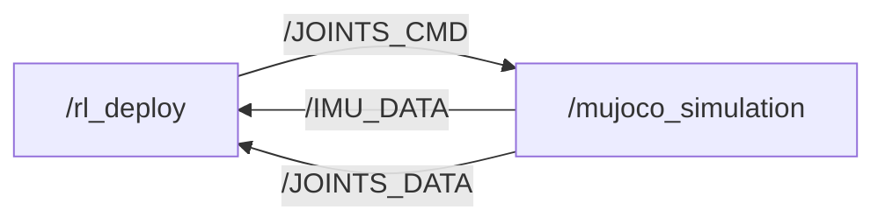

[English](./README_EN.md)

[](https://discord.gg/gdM9mQutC8)

## 总览

本仓库使用ROS2来实现Sim-to-sim和Sim-to-real全流程，故需在电脑上先安装好ROS2，如在Ubuntu22.04上安装[ROS2 Humble](https://docs.ros.org/en/humble/index.html)

```bash
# ros2 topic list
/BATTERY_DATA
/IMU_DATA
/JOINTS_CMD
/JOINTS_DATA
/parameter_events
/rosout


# ros2 node info /mujoco_simulation 
/mujoco_simulation
  Subscribers:
    /JOINTS_CMD: drdds/msg/JointsDataCmd
  Publishers:
    /IMU_DATA: drdds/msg/ImuData
    /JOINTS_DATA: drdds/msg/JointsData
    /parameter_events: rcl_interfaces/msg/ParameterEvent
    /rosout: rcl_interfaces/msg/Log
  Service Servers:
    /mujoco_simulation/describe_parameters: rcl_interfaces/srv/DescribeParameters
    /mujoco_simulation/get_parameter_types: rcl_interfaces/srv/GetParameterTypes
    /mujoco_simulation/get_parameters: rcl_interfaces/srv/GetParameters
    /mujoco_simulation/list_parameters: rcl_interfaces/srv/ListParameters
    /mujoco_simulation/set_parameters: rcl_interfaces/srv/SetParameters
    /mujoco_simulation/set_parameters_atomically: rcl_interfaces/srv/SetParametersAtomically
  Service Clients:

  Action Servers:

  Action Clients:


# ros2 node info /rl_deploy 
/rl_deploy
  Subscribers:
    /BATTERY_DATA: drdds/msg/BatteryData
    /IMU_DATA: drdds/msg/ImuData
    /JOINTS_DATA: drdds/msg/JointsData
    /parameter_events: rcl_interfaces/msg/ParameterEvent
  Publishers:
    /JOINTS_CMD: drdds/msg/JointsDataCmd
    /parameter_events: rcl_interfaces/msg/ParameterEvent
    /rosout: rcl_interfaces/msg/Log
  Service Servers:
    /rl_deploy/describe_parameters: rcl_interfaces/srv/DescribeParameters
    /rl_deploy/get_parameter_types: rcl_interfaces/srv/GetParameterTypes
    /rl_deploy/get_parameters: rcl_interfaces/srv/GetParameters
    /rl_deploy/list_parameters: rcl_interfaces/srv/ListParameters
    /rl_deploy/set_parameters: rcl_interfaces/srv/SetParameters
    /rl_deploy/set_parameters_atomically: rcl_interfaces/srv/SetParametersAtomically
  Service Clients:

  Action Servers:

  Action Clients:

```

## 二次开发
欢迎大家对我们的代码进行二次开发，无论是发现了bug还是优化了我们的训练代码，都可以提出一个pull request，我们会去研究审核并尝试融入我们的代码库。

## 仿真-仿真


```bash
pip install "numpy < 2.0" mujoco
git clone https://github.com/DeepRoboticsLab/sdk_deploy.git

# 编译
cd sdk_deploy
source /opt/ros/<ros-distro>/setup.bash
colcon build --packages-up-to rl_deploy --cmake-args -DBUILD_PLATFORM=x86
```

```bash
# 运行 (打开两个终端)
# 终端1 
export ROS_DOMAIN_ID=1
source install/setup.bash
ros2 run rl_deploy rl_deploy

# 终端2 
export ROS_DOMAIN_ID=1
source install/setup.bash
python3 src/M20_sdk_deploy/interface/robot/simulation/mujoco_simulation_ros2.py
```

### 操控(终端2)
<span style="color: red;">**注意:**</span>
> - 可以将仿真器窗口设为始终位于最上层，方便可视化
> - 当机器狗站起来时，有可能在仿真中会自碰撞卡住，这不是bug，请再尝试一次即可
> - z： 机器狗站立进入默认状态
> - c： 机器狗站立进入rl控制状态
> - wasd：前后左右
> - qe：顺逆时针旋转

## 仿真-实际
此过程和仿真-仿真几乎一模一样，只需要添加连wifi传输数据步骤，然后修改编译指令即可。目前默认实机操控为keyboard键盘模式，后续我们将会添加手柄控制模式，敬请期待。

请先使用手柄设置中的OTA升级功能将硬件升级为1.1.7版本

```bash
# 电脑和手柄均连接机器狗WiFi
# WiFi名称为 M20********
# WiFi密码为 12345678 (一般为这个，如有问题联系技术支持)

# scp传输文件 (打开本地电脑终端) 密码为' (单引号)
scp -r ~/sdk_deploy/src user@10.21.31.103:~/sdk_deploy/

# ssh连接机器狗运动主机以远程开发
ssh user@10.21.31.103
cd sdk_deploy
source /opt/ros/foxy/setup.bash
colcon build --packages-select rl_deploy --cmake-args -DBUILD_PLATFORM=arm 


sudo su # Root
source /opt/ros/foxy/setup.bash #source ROS2 env
source /opt/robot/scripts/setup_ros2.sh
ros2 service call /SDK_MODE drdds/srv/StdSrvInt32 command:\ 200 # 200 是 /JOINTS_DATA 话题的发布频率，建议设置在 500 Hz 以下。该数值只能是 1000 的因数。例如，如果你将频率设置为 200 Hz，则需要将 decimation 参数改为 1000/200 = 5。
# Run
source install/setup.bash
ros2 run rl_deploy rl_deploy
  
# 退出sdk模式：
ros2 service call /SDK_MODE drdds/srv/StdSrvInt32 command:\ 0

# 键盘输入状态切换
# 注意：当机器狗站起来时，有可能在仿真中会自碰撞卡住，这不是bug，请再尝试一次即可
- z： 机器狗站立进入默认状态 
- c： 机器狗站立进入rl控制状态
- wasd：前后左右
- qe：顺逆时针旋转
```

