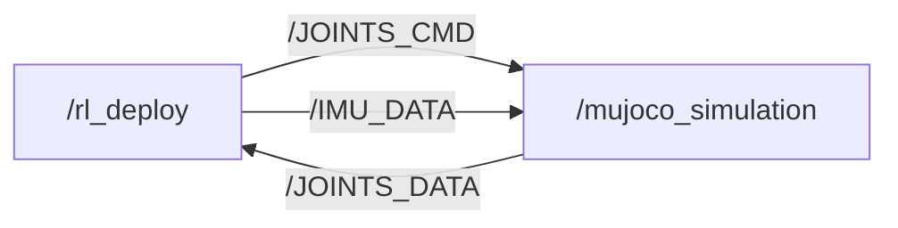

[简体中文](./README.md)

[](https://discord.gg/gdM9mQutC8)

```bash
# ros2 topic list
/BATTERY_DATA
/IMU_DATA
/JOINTS_CMD
/JOINTS_DATA
/parameter_events
/rosout


# ros2 node info /mujoco_simulation 
/mujoco_simulation
  Subscribers:
    /JOINTS_CMD: drdds/msg/JointsDataCmd
  Publishers:
    /IMU_DATA: drdds/msg/ImuData
    /JOINTS_DATA: drdds/msg/JointsData
    /parameter_events: rcl_interfaces/msg/ParameterEvent
    /rosout: rcl_interfaces/msg/Log
  Service Servers:
    /mujoco_simulation/describe_parameters: rcl_interfaces/srv/DescribeParameters
    /mujoco_simulation/get_parameter_types: rcl_interfaces/srv/GetParameterTypes
    /mujoco_simulation/get_parameters: rcl_interfaces/srv/GetParameters
    /mujoco_simulation/list_parameters: rcl_interfaces/srv/ListParameters
    /mujoco_simulation/set_parameters: rcl_interfaces/srv/SetParameters
    /mujoco_simulation/set_parameters_atomically: rcl_interfaces/srv/SetParametersAtomically
  Service Clients:

  Action Servers:

  Action Clients:


# ros2 node info /rl_deploy 
/rl_deploy
  Subscribers:
    /BATTERY_DATA: drdds/msg/BatteryData
    /IMU_DATA: drdds/msg/ImuData
    /JOINTS_DATA: drdds/msg/JointsData
    /parameter_events: rcl_interfaces/msg/ParameterEvent
  Publishers:
    /JOINTS_CMD: drdds/msg/JointsDataCmd
    /parameter_events: rcl_interfaces/msg/ParameterEvent
    /rosout: rcl_interfaces/msg/Log
  Service Servers:
    /rl_deploy/describe_parameters: rcl_interfaces/srv/DescribeParameters
    /rl_deploy/get_parameter_types: rcl_interfaces/srv/GetParameterTypes
    /rl_deploy/get_parameters: rcl_interfaces/srv/GetParameters
    /rl_deploy/list_parameters: rcl_interfaces/srv/ListParameters
    /rl_deploy/set_parameters: rcl_interfaces/srv/SetParameters
    /rl_deploy/set_parameters_atomically: rcl_interfaces/srv/SetParametersAtomically
  Service Clients:

  Action Servers:

  Action Clients:

```
## Sim-to-sim

```bash
pip install "numpy < 2.0" mujoco
git clone https://github.com/DeepRoboticsLab/M20_rl_deploy.git

# Compile
cd M20_rl_deploy
source /opt/ros/<ros-distro>/setup.bash
colcon build --packages-up-to rl_deploy --cmake-args -DBUILD_PLATFORM=x86
```

```bash
# Run (Open 2 terminals)
# Terminal 1
source install/setup.bash
ros2 run rl_deploy rl_deploy

# Terminal 2 
python3 src/M20_sdk_deploy/interface/robot/simulation/mujoco_simulation_ros2.py
```

### Control (Terminal 2)

<span style="color: red;">**Note:**</span>
> - Right click simulator window and select "always on top"
> - When the robot dog stands up, it may become stuck due to self-collision in the simulation. This is not a bug; please try again.
> - z： default position
> - c： rl control default position
> - wasd：forward/leftward/backward/rightward
> - qe：clockwise/counter clockwise


# Sim-to-Real
This process is almost identical to simulation-simulation. You only need to add the step of connecting to Wi-Fi to transfer data, and then modify the compilation instructions. The default control mode is currently set to keyboard mode. We will be adding controller support in future updates. Stay tuned.


Download drdds-ros2-msgs packages from [here](https://drive.google.com/file/d/1Nvxot_LOKMvLAr608kFtZ28gfsgA_dsx/view?usp=sharing) and install

```bash

# computer and gamepad should both connect to WiFi
# WiFi: M20********
# Passward: 12345678 (If wrong, contact technical support)

# scp to transfer files to quadruped (open a terminal on your local computer) password is ' (a single quote)
scp -r ~/M20_rl_deploy user@10.21.31.103:~/

# ssh connect for remote development, 
ssh user@10.21.31.103
cd M20_rl_deploy
colcon build --packages-select rl_deploy --cmake-args -DBUILD_PLATFORM=arm


sudo su # Root
sudo dpkg -i drdds-ros2-msgs.v1.0.2+.arm64.2510291519.deb
source /opt/ros/foxy/setup.bash #source ROS2 env
source /opt/robot/scripts/setup_ros2.sh
ros2 service call /SDK_MODE drdds/srv/StdSrvInt32 command:\ 200 # /200 is /JOINTS_DATA topic frequency, recommended below 500 Hz

# Run
source install/setup.bash
ros2 run rl_deploy rl_deploy

# exit sdk mode：
ros2 service call /SDK_MODE drdds/srv/StdSrvInt32 command:\ 0

# keyboard control
Note: When the robot dog stands up, it may become stuck due to self-collision in the simulation. This is not a bug; please try again.
- z： default position
- c： rl control default position
- wasd：forward/leftward/backward/rightward
- qe：clockwise/counter clockwise
```

