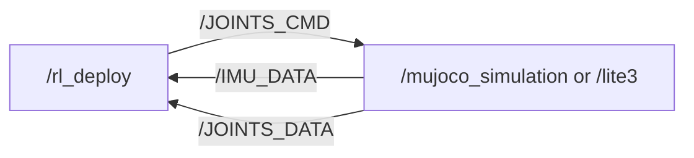
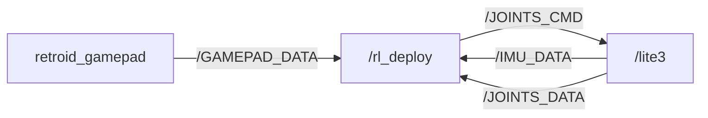
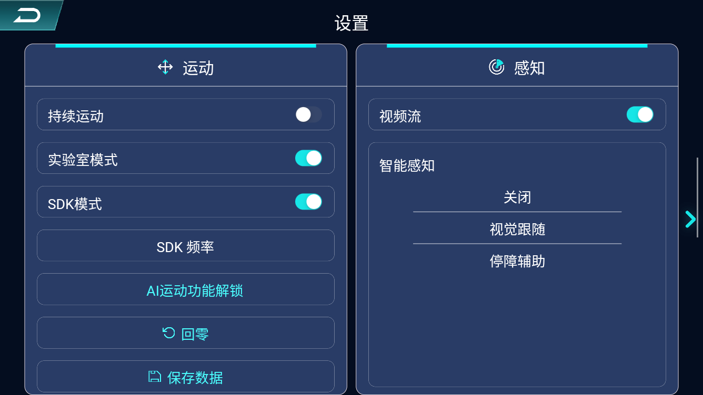

# Lite3 SDK Deploy

[](https://discord.gg/gdM9mQutC8)  
## Note
<span style="color: red;">**SDK deployment is only available for Lite 3 Venture Edition.**</span>  
## Overview
This repository uses ROS2 to implement the entire Sim-to-sim and Sim-to-real workflow. Therefore, ROS2 must first be installed on your computer, such as installing [ROS2 Humble](https://docs.ros.org/en/humble/index.html) on Ubuntu 22.04.
Keyboard controls, the process is as follows:

Gamepad controls (only Sim-to-real), the process is as follows:

```bash
# ros2 topic list
/BATTERY_DATA(Not yet open)
/IMU_DATA
/JOINTS_CMD
/JOINTS_DATA
/GAMEPAD_DATA
/parameter_events
/rosout

# ros2 node info /rl_deploy 
/rl_deploy
  Subscribers:
    /BATTERY_DATA: drdds/msg/BatteryData
    /IMU_DATA: drdds/msg/ImuData
    /JOINTS_DATA: drdds/msg/JointsData
    /parameter_events: rcl_interfaces/msg/ParameterEvent
  Publishers:
    /JOINTS_CMD: drdds/msg/JointsDataCmd
    /parameter_events: rcl_interfaces/msg/ParameterEvent
    /rosout: rcl_interfaces/msg/Log
  Service Servers:
    /rl_deploy/describe_parameters: rcl_interfaces/srv/DescribeParameters
    /rl_deploy/get_parameter_types: rcl_interfaces/srv/GetParameterTypes
    /rl_deploy/get_parameters: rcl_interfaces/srv/GetParameters
    /rl_deploy/list_parameters: rcl_interfaces/srv/ListParameters
    /rl_deploy/set_parameters: rcl_interfaces/srv/SetParameters
    /rl_deploy/set_parameters_atomically: rcl_interfaces/srv/SetParametersAtomically
  Service Clients:

  Action Servers:

  Action Clients:

# Run mujoco node in simulation
# ros2 node info /mujoco_simulation 
/mujoco_simulation
  Subscribers:
    /JOINTS_CMD: drdds/msg/JointsDataCmd
  Publishers:
    /IMU_DATA: drdds/msg/ImuData
    /JOINTS_DATA: drdds/msg/JointsData
    /parameter_events: rcl_interfaces/msg/ParameterEvent
    /rosout: rcl_interfaces/msg/Log
  Service Servers:
    /mujoco_simulation/describe_parameters: rcl_interfaces/srv/DescribeParameters
    /mujoco_simulation/get_parameter_types: rcl_interfaces/srv/GetParameterTypes
    /mujoco_simulation/get_parameters: rcl_interfaces/srv/GetParameters
    /mujoco_simulation/list_parameters: rcl_interfaces/srv/ListParameters
    /mujoco_simulation/set_parameters: rcl_interfaces/srv/SetParameters
    /mujoco_simulation/set_parameters_atomically: rcl_interfaces/srv/SetParametersAtomically
  Service Clients:

  Action Servers:

  Action Clients:
```

## Contribution 

Everyone is welcome to contribute to this repo. If you discover a bug or optimize our training config, just submit a pull request and we will look into it.

## Sim-to-sim
```bash
pip install "numpy < 2.0" mujoco
git clone https://github.com/DeepRoboticsLab/sdk_deploy.git

# Compile
cd sdk_deploy
source /opt/ros/<ros-distro>/setup.bash
colcon build --packages-up-to lite3_sdk_deploy --cmake-args -DBUILD_PLATFORM=x86
```

```bash
# Run (Open 2 terminals)
# Terminal 1 
source install/setup.bash
ros2 run lite3_sdk_deploy rl_deploy

# Terminal 2
source install/setup.bash
python3 src/Lite3_sdk_deploy/interface/robot/simulation/mujoco_simulation_ros2.py
```

### Control (Terminal 2)

<span style="color: red;">**Note:**</span>
> - Right click simulator window and select "always on top"
> - When the robot dog stands up, it may become stuck due to self-collision in the simulation. This is not a bug; please try again.
> - z： default position
> - c： rl control default position
> - wasd：forward/leftward/backward/rightward
> - qe：clockwise/counter clockwise

## Sim-to-real  
**Before proceeding with this step, verify the version of your Lite3 system image. Ensure the image has ROS 2 and the transfer functionality package installed. If the image has not been upgraded, please contact your technical support.**
The default controller mode is currently set to keyboard mode. To switch to gamepad control, modify `RemoteCommandType::kKeyBoard` to `RemoteCommandType::kRetroidGamepad` in `main.cpp`.
### SDK Mode Activation and Switching
<span style="color: red;">**Warning: Ensure Lite3 switches modes while in a safe state such as idle; failure to do so may result in machine damage or personal injury.**</span>  
<span style="color: red;">**Warning: Switching states requires processing time. After pressing the slider, please wait for approximately 10 seconds. Then manually rotate the joint to ensure it moves freely without resistance and is not in damping mode. Only then proceed with standing up or walking. Failure to do so may cause dangerous situations such as the Lite3 suddenly jumping up or dashing forward.**</span>
> - Click the slider to the right of SDK Mode. When the slider turns blue, it indicates that SDK Mode is enabled. Lite3 will automatically perform a zero-reset. On the contrary，SDK mode will become inactive, and the system will switch to MPC mode.  


### SSH connection
```bash
# computer and gamepad should both connect to WiFi
# WiFi: lite3********
# Passward: 12345678 (If wrong, contact technical support)

# ssh connect for remote development
#Username	Password
#ysc		' (a single quote)
ssh ysc@192.168.2.1
# enter your passward, the terminal will be active on the Lite3 computer
```
### SDK Deployment
**Compile ROS2 package**
```bash
# scp to transfer files to lite3 (open a terminal on your local computer) password is ' (a single quote)
ssh ysc@192.168.2.1 'mkdir -p ~/Lite3_sdk_deploy/src' && \
scp -r ~/sdk_deploy/src/drdds ~/sdk_deploy/src/Lite3_sdk_deploy ysc@192.168.2.1:~/Lite3_sdk_deploy/src

# ssh connect for remote development
ssh ysc@192.168.2.1
cd Lite3_sdk_deploy
source /opt/ros/foxy/setup.bash
colcon build --packages-up-to lite3_sdk_deploy --cmake-args -DBUILD_PLATFORM=arm 
```
**Run sdk deploy**
```bash
# run rl_deploy control
cd Lite3_sdk_deploy
source install/setup.bash
ros2 run lite3_sdk_deploy rl_deploy
```
<span style="color: red;">**keyboard control:**</span>
> - z： default position
> - c： rl control default position
> - wasd：forward/leftward/backward/rightward
> - qe：clockwise/counter clockwise

<span style="color: red;">**gamepad control:**</span>
> - Y： default position
> - A： rl control default position
> - Left joystick：forward/leftward/backward/rightward
> - Right joystick：clockwise/counter clockwise

**(Optional) Change topic frequency**  
> - You can use the App on the Retroid gamepad to adjust the publishing frequency of /JOINTS_DATA and /IMU_DATA.  
 

> - Additionally, you can modify the /JOINTS_DATA and /IMU_DATA publish frequency using ROS2 commands.
```bash
ros2 service call /SDK_MODE drdds/srv/StdSrvInt32 command:"{command: 200}" 
# The posting frequency for the /JOINTS_DATA and /IMU_DATA topic. The default value is 200.
```
**(Optional) Cross-host communication**  
The Lite3 computer has limited resources. To expand other functionalities, you may additionally configure a host computer (such as NVIDIA Jetson) for ROS2 communication.
1. Connect the host to Lite3 via a wired Ethernet cable.
2. Following the steps above, run rl_deploy on the host computer.
When compiling rl_deploy on the host computer, you may encounter the following error:
```bash
/opt/rh/gcc-toolset-14/root/usr/include/c++/14/bits/stl_vector.h:1130: std::vector<_Tp, _Alloc>::reference std::vector<_Tp, _Alloc>::operator[](size_type) [with _Tp = unsigned int; _Alloc = std::allocator<unsigned int>; reference = unsigned int&; size_type = long unsigned int]: Assertion '__n < this->size()' failed.
```
This is caused by an incompatible version of the ONNX Runtime library within the third_party directory of rl_deploy. Please select the appropriate ONNX Runtime library version based on your host architecture.  
Verified cross-host cases:
1.  NVIDIA Jetson AGX Orin with Jetpack version 6.1 and CUDA version 12.6. using the `onnxruntime-linux-aarch64-gpu-cuda12-1.18.1.tar.bz2` version from [csukuangfj/onnxruntime-libs](https://github.com/csukuangfj/onnxruntime-libs/releases?page=2).
