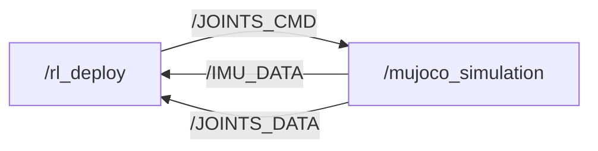

# M20 SDK Deploy

[](https://discord.gg/gdM9mQutC8)
## Overview
This repository uses ROS2 to implement the entire Sim-to-sim and Sim-to-real workflow. Therefore, ROS2 must first be installed on your computer, such as installing [ROS2 Humble](https://docs.ros.org/en/humble/index.html) on Ubuntu 22.04. We've also released an introduction [video](https://www.youtube.com/watch?v=FNaxsDBtD7A), please check it out! Please go through the whole process on a Ubuntu system.

```bash
# ros2 topic list
/BATTERY_DATA
/IMU_DATA
/JOINTS_CMD
/JOINTS_DATA
/parameter_events
/rosout


# ros2 node info /mujoco_simulation 
/mujoco_simulation
  Subscribers:
    /JOINTS_CMD: drdds/msg/JointsDataCmd
  Publishers:
    /IMU_DATA: drdds/msg/ImuData
    /JOINTS_DATA: drdds/msg/JointsData
    /parameter_events: rcl_interfaces/msg/ParameterEvent
    /rosout: rcl_interfaces/msg/Log
  Service Servers:
    /mujoco_simulation/describe_parameters: rcl_interfaces/srv/DescribeParameters
    /mujoco_simulation/get_parameter_types: rcl_interfaces/srv/GetParameterTypes
    /mujoco_simulation/get_parameters: rcl_interfaces/srv/GetParameters
    /mujoco_simulation/list_parameters: rcl_interfaces/srv/ListParameters
    /mujoco_simulation/set_parameters: rcl_interfaces/srv/SetParameters
    /mujoco_simulation/set_parameters_atomically: rcl_interfaces/srv/SetParametersAtomically
  Service Clients:

  Action Servers:

  Action Clients:


# ros2 node info /rl_deploy 
/rl_deploy
  Subscribers:
    /BATTERY_DATA: drdds/msg/BatteryData
    /IMU_DATA: drdds/msg/ImuData
    /JOINTS_DATA: drdds/msg/JointsData
    /parameter_events: rcl_interfaces/msg/ParameterEvent
  Publishers:
    /JOINTS_CMD: drdds/msg/JointsDataCmd
    /parameter_events: rcl_interfaces/msg/ParameterEvent
    /rosout: rcl_interfaces/msg/Log
  Service Servers:
    /rl_deploy/describe_parameters: rcl_interfaces/srv/DescribeParameters
    /rl_deploy/get_parameter_types: rcl_interfaces/srv/GetParameterTypes
    /rl_deploy/get_parameters: rcl_interfaces/srv/GetParameters
    /rl_deploy/list_parameters: rcl_interfaces/srv/ListParameters
    /rl_deploy/set_parameters: rcl_interfaces/srv/SetParameters
    /rl_deploy/set_parameters_atomically: rcl_interfaces/srv/SetParametersAtomically
  Service Clients:

  Action Servers:

  Action Clients:

```
## Contribution 

Everyone is welcome to contribute to this repo. If you discover a bug or optimize our training config, just submit a pull request and we will look into it.
## Sim-to-sim

Installing MuJoCo-LiDAR(https://github.com/TATP-233/MuJoCo-LiDAR.git) for simulation with lidar sensor:
```bash
git clone https://github.com/TATP-233/MuJoCo-LiDAR.git
cd MuJoCo-LiDAR
pip3 install --user -e .[taichi] --break-system-packages
```

Elevation Mapping:
```bash
mkdir -p ~/colcon_ws/src
cd ~/colcon_ws/src
git clone https://github.com/ruihuang1124/elevation_mapping_cupy.git
cd ~/colcon_ws
rosdep install --from-paths src --ignore-src -r -y
colcon build \
  --symlink-install \
  --packages-select elevation_map_msgs elevation_mapping_cupy \
  --cmake-args -DCMAKE_EXPORT_COMPILE_COMMANDS=ON
source install/setup.bash
ros2 launch elevation_mapping_cupy elevation_mapping.launch.py robot_config:=m20.yaml
```


```bash
pip install "numpy < 2.0" mujoco
git clone https://github.com/DeepRoboticsLab/sdk_deploy.git

# Compile
cd sdk_deploy
source /opt/ros/<ros-distro>/setup.bash
colcon build --packages-up-to m20_sdk_deploy --cmake-args -DBUILD_PLATFORM=x86
```

```bash
# Run (Open 2 terminals)
# Terminal 1
export ROS_DOMAIN_ID=1
source install/setup.bash
ros2 run m20_sdk_deploy rl_deploy

# Terminal 2 
export ROS_DOMAIN_ID=1
source install/setup.bash
python3 src/M20_sdk_deploy/interface/robot/simulation/mujoco_simulation_ros2.py
```

### Control (Terminal 2)

<span style="color: red;">**Note:**</span>
> - Right click simulator window and select "always on top"
> - When the robot dog stands up, it may become stuck due to self-collision in the simulation. This is not a bug; please try again.
> - z： default position
> - c： rl control default position
> - wasd：forward/leftward/backward/rightward
> - qe：clockwise/counter clockwise


# Sim-to-Real
This process is almost identical to simulation-simulation. You only need to add the step of connecting to Wi-Fi to transfer data, and then modify the compilation instructions. The default control mode is currently set to keyboard mode. We will be adding controller support in future updates. Stay tuned.


Please first use the OTA upgrade function in the handle settings to upgrade the hardware to version 1.1.7.

```bash

# computer and gamepad should both connect to WiFi
# WiFi: M20********
# Passward: 12345678 (If wrong, contact technical support)

# scp to transfer files to quadruped (open a terminal on your local computer) password is ' (a single quote)
scp -r ~/sdk_deploy/src user@10.21.31.103:~/sdk_deploy

# ssh connect for remote development, 
ssh user@10.21.31.103
cd sdk_deploy
source /opt/ros/foxy/setup.bash #source ROS2 env
colcon build --packages-select m20_sdk_deploy --cmake-args -DBUILD_PLATFORM=arm


sudo su # Root
source /opt/ros/foxy/setup.bash # source ROS2 env
source /opt/robot/scripts/setup_ros2.sh
ros2 service call /SDK_MODE drdds/srv/StdSrvInt32 "{command: 200}" # 200 is /JOINTS_DATA frequency. Recommended below 500 Hz. This value can only be factors of 1000.

# Start and enable LIO perception before running sensor policies.
# The systemd service starts the lio_ddsnode process. The start.sh script sends
# the runtime enable command (lio_command 1); it is still needed after reboot.
systemctl status lio_perception.service height_map_nav.service --no-pager
systemctl restart lio_perception.service height_map_nav.service
/opt/robot/share/lio_perception/scripts/start.sh

# Optional read-only checks. Expected: /CLOUD_REGISTERED_BODY and /LIO_ODOM at ~10 Hz,
# /IMU_DATA at high rate, and /JOINTS_DATA near the SDK_MODE frequency.
ros2 topic list | grep -E "CLOUD_REGISTERED_BODY|LIO_ODOM|height_map|IMU_DATA|JOINTS_DATA"
ros2 topic hz /CLOUD_REGISTERED_BODY
ros2 topic hz /LIO_ODOM

# Run
source /opt/ros/foxy/setup.bash #source ROS2 env
source /opt/robot/scripts/setup_ros2.sh
source install/setup.bash
ros2 run m20_sdk_deploy rl_deploy

# exit sdk mode:
ros2 service call /SDK_MODE drdds/srv/StdSrvInt32 "{command: 0}"

# keyboard control
Note: When the robot dog stands up, it may become stuck due to self-collision in the simulation. This is not a bug; please try again.
- z： default position
- c： rl control default position
- wasd：forward/leftward/backward/rightward
- qe：clockwise/counter clockwise
```

# Unified Policy with Elevation (noisy_elevation)

新的 `policy/unified_policy.onnx`（由 `rl_sensor_control_state` 加载）在原有 LiDAR scan 之外**新增了 elevation map (height_scan)**。运行器 `M20SensorPolicyRunner` 会从 ONNX 输入 0 (`proprio_and_env`) 的 shape **自适应**感知维度，无需手改常量：

| 策略 | `proprio_and_env` | 感知来源 |
|---|---|---|
| 旧 scan 策略 (platform/crawl) | `[1, 1049]` = proprio 57 + scan 992 | `/scan/multi_layer_features_array` (旧 `lidar_to_scan.py`) |
| 新 unified + elevation | `[1, 748]` = proprio 57 + noisy_elevation 691 | `/perception/noisy_elevation_array` (新节点) |
| gap + elevation | `[1, 496]` = proprio 57 + height/scan 439 | `/perception/noisy_elevation_array` 前 439 维 |

`noisy_elevation` 顺序写死：`[ height_scan(187) | forward_scan(252) | backward_scan(252) ] = 691`。顺序错位不会报错，只会输出错误动作。

## 感知节点 `scripts/noisy_elevation_node.py`

部署在感知机 (106)，发布完整 691 维数组到 `/perception/noisy_elevation_array`：
- **forward/backward_scan (252 each)**：点云按 `multi_pitch_arc` 几何分格（pitch 12 档 ∈[-25,25]°，azimuth 21 档 ∈[-45,45]°，boresight ±X，flatten `k=pitch*21+az`），归一化 `clip(d/2.5,0,1)`、`<0.3m→1.0`。
- **height_scan (187)**：17×11 @0.1m yaw 网格，`clamp(-terrain_z_base - 0.5, -1, 1)`，terrain 取自 base 系高程网格；**不依赖 odom 绝对 z**。

参数：`lidar_topic`（默认 `/LIDAR_SIM_RAW`；真机 `/CLOUD_REGISTERED_BODY`）、`height_topic`（默认 `/height_map`）。

```bash
# Sim
python3 src/M20_sdk_deploy/scripts/noisy_elevation_node.py

# 真机 (106)
python3 src/M20_sdk_deploy/scripts/noisy_elevation_node.py \
  --ros-args -p lidar_topic:=/CLOUD_REGISTERED_BODY -p height_topic:=/height_map
```

## 真机注意事项（重要）

**① LIO 启动顺序** — `lio_perception.service` 只负责启动 `lio_ddsnode` 进程；重启后还需要运行 `start.sh` 发送 `lio_command 1`，否则 `/CLOUD_REGISTERED_BODY` 和 `/LIO_ODOM` 可能只有 publisher 但没有实际数据：
```bash
sudo su
source /opt/ros/foxy/setup.bash
source /opt/robot/scripts/setup_ros2.sh
systemctl restart lio_perception.service height_map_nav.service
/opt/robot/share/lio_perception/scripts/start.sh
```

**② DDS profile** — 在机器人本机 (103) 上优先使用 README 中的环境：
```bash
source /opt/ros/foxy/setup.bash
source /opt/robot/scripts/setup_ros2.sh
```
如果是在外部电脑或另一台机载电脑上订阅感知话题，且 `ros2 topic list/info` 能发现 `/CLOUD_REGISTERED_BODY`、`/LIO_ODOM`、`/height_map` 但收不到样本，再尝试覆盖为 builtin profile：
```bash
source /opt/robot/scripts/setup_ros2.sh
export FASTRTPS_DEFAULT_PROFILES_FILE=/opt/robot/fastdds_profile.xml   # builtin，须在 setup 之后
```

**③ 开启高程图** — LIO 自带的 `/HEIGHT_POINTS`/`/HEIGHT_IMAGE` 是关闭的**静态占位**（恒 -0.4，stamp=0），勿用。真实高程来自 `height_map_nav` 的 `/height_map`（base_link，81×81 @0.1m），需先开启（纯感知开关，不会让机器人动作）：
```bash
ros2 service call /HEIGHT_MAP_ENABLE drdds/srv/StdSrvInt32 "{command: 1}"   # 0 = 关闭
```
它依赖 `/CLOUD_REGISTERED_BODY`(~10Hz) + `/LIO_ODOM` + `/IMU_YESENSE` 输入。

`height_map_nav` 没有类似 LIO 的 `start.sh`。如果 `/HEIGHT_MAP_ENABLE` 调用不返回，直接把 DDS 配置默认开启后重启服务：
```bash
sudo cp /opt/robot/share/height_map_nav/config/height_map_dds.yaml \
  /opt/robot/share/height_map_nav/config/height_map_dds.yaml.bak
sudo sed -i "s/^default_enable:.*/default_enable: true/" \
  /opt/robot/share/height_map_nav/config/height_map_dds.yaml
sudo systemctl restart height_map_nav.service
```
日志中应出现 `default_enable: 1` 和 `Data freq(Hz): Cloud=10 Odom=10 IMU=200` 左右。

> 注：`/SDK_MODE ... 200` 进入 SDK 模式后机器人会受控动作，需配合外部急停按钮流程；详见硬件文档。

## 本机一键真机部署脚本

WiFi 拓扑下可以在本机依次启动 103/106/手柄/网页高度图可视化：

```bash
cd /home/ouge/Software/sdk_deploy
python3 src/M20_sdk_deploy/scripts/real_robot_deploy.py start
```

脚本会自动通过 `sudo -S` 填 103/106 的 sudo 密码，默认密码是单引号 `'`。如需覆盖：

```bash
M20_SUDO_PASSWORD="..." python3 src/M20_sdk_deploy/scripts/real_robot_deploy.py start
# 或
python3 src/M20_sdk_deploy/scripts/real_robot_deploy.py start --sudo-password "..."
```

默认执行顺序：
1. 103：重启 `lio_perception.service`/`height_map_nav.service`，执行 LIO `start.sh`，开启 `/height_map`，进入 SDK mode (`/SDK_MODE command:200`)，启动 `sdk_deploy_tty` 里的 `rl_deploy`。
2. 106：启动 `noisy_elevation_node.py`，发布 `/perception/noisy_elevation_array`。
3. 本机：启动 `joy_tcp_sender.py --ip 10.21.41.1 --port 9999`。
4. 本机：启动网页 3D 高度图可视化 `http://127.0.0.1:8765/`。

只检查将要执行的命令，不真正启动：

```bash
python3 src/M20_sdk_deploy/scripts/real_robot_deploy.py start --dry-run
```

查看/停止：

```bash
python3 src/M20_sdk_deploy/scripts/real_robot_deploy.py status
python3 src/M20_sdk_deploy/scripts/real_robot_deploy.py stop
```

`stop` 只停止本仓库启动的 `sdk_deploy_tty` 控制进程、106 的 `noisy_elevation_node.py`、本机 joystick/网页可视化，并调用 `/SDK_MODE command:0` 退出 SDK mode；不会清理 `/opt/robot/share/rl_deploy` 等官方常驻进程。
