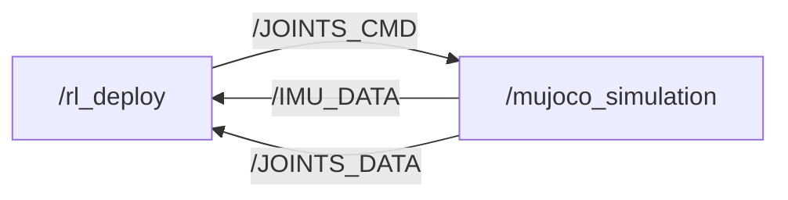

# M20 SDK Deploy

[](https://discord.gg/gdM9mQutC8)
## Overview
This repository uses ROS2 to implement the entire Sim-to-sim and Sim-to-real workflow. Therefore, ROS2 must first be installed on your computer, such as installing [ROS2 Humble](https://docs.ros.org/en/humble/index.html) on Ubuntu 22.04. We've also released an introduction [video](https://www.youtube.com/watch?v=FNaxsDBtD7A), please check it out! Please go through the whole process on a Ubuntu system.

```bash
# ros2 topic list
/BATTERY_DATA
/IMU_DATA
/JOINTS_CMD
/JOINTS_DATA
/parameter_events
/rosout


# ros2 node info /mujoco_simulation 
/mujoco_simulation
  Subscribers:
    /JOINTS_CMD: drdds/msg/JointsDataCmd
  Publishers:
    /IMU_DATA: drdds/msg/ImuData
    /JOINTS_DATA: drdds/msg/JointsData
    /parameter_events: rcl_interfaces/msg/ParameterEvent
    /rosout: rcl_interfaces/msg/Log
  Service Servers:
    /mujoco_simulation/describe_parameters: rcl_interfaces/srv/DescribeParameters
    /mujoco_simulation/get_parameter_types: rcl_interfaces/srv/GetParameterTypes
    /mujoco_simulation/get_parameters: rcl_interfaces/srv/GetParameters
    /mujoco_simulation/list_parameters: rcl_interfaces/srv/ListParameters
    /mujoco_simulation/set_parameters: rcl_interfaces/srv/SetParameters
    /mujoco_simulation/set_parameters_atomically: rcl_interfaces/srv/SetParametersAtomically
  Service Clients:

  Action Servers:

  Action Clients:


# ros2 node info /rl_deploy 
/rl_deploy
  Subscribers:
    /BATTERY_DATA: drdds/msg/BatteryData
    /IMU_DATA: drdds/msg/ImuData
    /JOINTS_DATA: drdds/msg/JointsData
    /parameter_events: rcl_interfaces/msg/ParameterEvent
  Publishers:
    /JOINTS_CMD: drdds/msg/JointsDataCmd
    /parameter_events: rcl_interfaces/msg/ParameterEvent
    /rosout: rcl_interfaces/msg/Log
  Service Servers:
    /rl_deploy/describe_parameters: rcl_interfaces/srv/DescribeParameters
    /rl_deploy/get_parameter_types: rcl_interfaces/srv/GetParameterTypes
    /rl_deploy/get_parameters: rcl_interfaces/srv/GetParameters
    /rl_deploy/list_parameters: rcl_interfaces/srv/ListParameters
    /rl_deploy/set_parameters: rcl_interfaces/srv/SetParameters
    /rl_deploy/set_parameters_atomically: rcl_interfaces/srv/SetParametersAtomically
  Service Clients:

  Action Servers:

  Action Clients:

```
## Contribution 

Everyone is welcome to contribute to this repo. If you discover a bug or optimize our training config, just submit a pull request and we will look into it.
## Sim-to-sim

Installing MuJoCo-LiDAR(https://github.com/TATP-233/MuJoCo-LiDAR.git) for simulation with lidar sensor:
```bash
git clone https://github.com/TATP-233/MuJoCo-LiDAR.git
cd MuJoCo-LiDAR
pip3 install --user -e .[taichi] --break-system-packages
```

Elevation Mapping:
```bash
mkdir -p ~/colcon_ws/src
cd ~/colcon_ws/src
git clone https://github.com/ruihuang1124/elevation_mapping_cupy.git
cd ~/colcon_ws
rosdep install --from-paths src --ignore-src -r -y
colcon build \
  --symlink-install \
  --packages-select elevation_map_msgs elevation_mapping_cupy \
  --cmake-args -DCMAKE_EXPORT_COMPILE_COMMANDS=ON
source install/setup.bash
ros2 launch elevation_mapping_cupy elevation_mapping.launch.py robot_config:=m20.yaml
```


```bash
pip install "numpy < 2.0" mujoco
git clone https://github.com/DeepRoboticsLab/sdk_deploy.git

# Compile
cd sdk_deploy
source /opt/ros/<ros-distro>/setup.bash
colcon build --packages-up-to m20_sdk_deploy --cmake-args -DBUILD_PLATFORM=x86
```

```bash
# Run (Open 2 terminals)
# Terminal 1
export ROS_DOMAIN_ID=1
source install/setup.bash
ros2 run m20_sdk_deploy rl_deploy

# Terminal 2 
export ROS_DOMAIN_ID=1
source install/setup.bash
python3 src/M20_sdk_deploy/interface/robot/simulation/mujoco_simulation_ros2.py
```

### Control (Terminal 2)

<span style="color: red;">**Note:**</span>
> - Right click simulator window and select "always on top"
> - When the robot dog stands up, it may become stuck due to self-collision in the simulation. This is not a bug; please try again.
> - z： default position
> - c： rl control default position
> - wasd：forward/leftward/backward/rightward
> - qe：clockwise/counter clockwise


# Sim-to-Real

先用手柄 OTA 将机器人硬件升级到 1.1.7 或更新版本。真机 WiFi 拓扑默认如下：

- 本机和手柄连接机器人 WiFi。
- 103 控制机：`user@10.21.41.1`。
- 106 感知机：`user@10.21.33.106`，从本机经 103 跳转访问。
- 103/106 的 sudo 密码默认是单引号 `'`。
- 103 上代码路径默认是 `/home/user/sdk_deploy_tty`。

> 进入 SDK mode 后机器人会受控动作。启动前确认外部急停和软急停可用；用软急停退出后，如需再次测试，重新运行方案 A 即可。

## 方案 A：本机一键启动

在本机执行：

```bash
cd /home/ouge/Software/sdk_deploy
python3 src/M20_sdk_deploy/scripts/real_robot_deploy.py start --no-open-browser
```

上面的命令在 bash/zsh 下都可直接复制。默认 sudo 密码是单引号 `'`，脚本内部会自动填写，不需要在命令行手写这个单引号。

可选：在新电脑上先配置 103 免密 SSH，后续一键启动就不需要输入 SSH 登录密码：

```bash
ssh-keygen -t ed25519 -f ~/.ssh/id_ed25519 -N "" -C "$(whoami)@$(hostname)" 2>/dev/null || true
ssh-copy-id -i ~/.ssh/id_ed25519.pub user@10.21.41.1
```

脚本会依次完成：

1. 预检本机，默认把本机最新 `noisy_elevation_node.py` 同步到 103，再检查 103 的路径、二进制和关键脚本。
2. 103：确认/启动 LIO 和官方 `height_map_nav`，必要时调用 `/HEIGHT_MAP_ENABLE`，进入 SDK mode (`/SDK_MODE command:200`)。
3. 103：启动 `lidar_to_scan_cpp`，发布旧平台/爬行策略需要的 `/scan/multi_layer_features_array`（992 维），随后启动本仓库 `rl_deploy`。
4. 103：启动 `noisy_elevation_node.py`，从官方 `/height_map` + `/CLOUD_REGISTERED_BODY` 生成 `/perception/noisy_elevation_array`。
5. 103：等待 `/perception/noisy_elevation_array` 首帧，确认 Y 策略有 691 维感知输入。
6. 等待 103 上 TCP 控制端口 `:9999` 监听。
7. 本机：启动 `joy_tcp_sender.py`，把手柄数据发往 `10.21.41.1:9999`。
8. 本机：启动官方高度图 3D 网页可视化 `http://127.0.0.1:8765/`。

常用命令：

```bash
# 只打印将要执行的命令，不启动真机控制
python3 src/M20_sdk_deploy/scripts/real_robot_deploy.py start --dry-run --no-open-browser

# 查看当前进程和端口
python3 src/M20_sdk_deploy/scripts/real_robot_deploy.py status

# 停止本仓库启动的控制/感知/手柄/网页，并退出 SDK mode
python3 src/M20_sdk_deploy/scripts/real_robot_deploy.py stop
```

如果 sudo 密码不是默认单引号：

```bash
M20_SUDO_PASSWORD="your_password" \
python3 src/M20_sdk_deploy/scripts/real_robot_deploy.py start --no-open-browser
```

如果在另一台电脑上不想处理 shell 引号，也可以让脚本在本机只询问一次密码：

```bash
python3 src/M20_sdk_deploy/scripts/real_robot_deploy.py start --ask-sudo-password --no-open-browser
```

不要写成 `--sudo-password '`；这个单引号会被 bash/zsh 当作 shell 引号解析。需要命令行参数时用双引号，例如 `--sudo-password "your_password"`。

如果 LIO 偶发没启动，脚本默认会在 sudo 下最多尝试 4 次，每次超时 12 秒；每次成功后会检查 103 是否收到 `/CLOUD_REGISTERED_BODY`，有数据就停止重试。启动成功后看状态灯确认已进入 SDK mode，再用手柄切换模式和控制机器人。

## 方案 B：手动启动/排查

103 上进入 SDK mode：

```bash
ssh user@10.21.41.1
sudo su
source /opt/ros/foxy/setup.bash
source /opt/robot/scripts/setup_ros2.sh
ros2 service call /SDK_MODE drdds/srv/StdSrvInt32 "{command: 200}"
```

103 上启动/确认 LIO 和 height map：

```bash
systemctl restart lio_perception.service height_map_nav.service

# LIO 有时需要重复运行 3-4 次；每次等待 10 秒以上即可。
/opt/robot/share/lio_perception/scripts/start.sh

# height map enable 有时会阻塞；不影响先启动控制，可另开终端排查。
timeout 10 ros2 service call /HEIGHT_MAP_ENABLE drdds/srv/StdSrvInt32 "{command: 1}" || true

ros2 topic list | grep -E "CLOUD_REGISTERED_BODY|LIO_ODOM|height_map|IMU_DATA|JOINTS_DATA"
```

103 上启动本仓库控制端：

```bash
cd /home/user/sdk_deploy_tty
source /opt/ros/foxy/setup.bash
source /opt/robot/scripts/setup_ros2.sh
source install/setup.bash
ros2 run m20_sdk_deploy rl_deploy
```

106 上启动 elevation 感知：

```bash
ssh -J user@10.21.41.1 user@10.21.33.106
sudo su
cd /home/user/sdk_deploy_tty
source /opt/ros/foxy/setup.bash
source /opt/robot/scripts/setup_ros2.sh
python3 src/M20_sdk_deploy/scripts/noisy_elevation_node.py \
  --ros-args \
  -p lidar_topic:=/CLOUD_REGISTERED_BODY \
  -p height_topic:=/height_map \
  -p terrain_cache_scan:=true \
  -p fk_height_scan:=false \
  -p zero_height_scan:=false
```

本机启动手柄发送：

```bash
cd /home/ouge/Software/sdk_deploy
python3 src/M20_sdk_deploy/scripts/joy_tcp_sender.py \
  --ip 10.21.41.1 \
  --port 9999 \
  --device /dev/input/js0 \
  --rate 200
```

退出 SDK mode：

```bash
ssh user@10.21.41.1
sudo su
source /opt/ros/foxy/setup.bash
source /opt/robot/scripts/setup_ros2.sh
ros2 service call /SDK_MODE drdds/srv/StdSrvInt32 "{command: 0}"
```

# Unified Policy with Elevation (noisy_elevation)

新的 `policy/unified_policy.onnx`（由 `rl_sensor_control_state` 加载）在原有 LiDAR scan 之外**新增了 elevation map (height_scan)**。运行器 `M20SensorPolicyRunner` 会从 ONNX 输入 0 (`proprio_and_env`) 的 shape **自适应**感知维度，无需手改常量：

| 策略 | `proprio_and_env` | 感知来源 |
|---|---|---|
| 旧 scan 策略 (platform/crawl) | `[1, 1049]` = proprio 57 + scan 992 | `/scan/multi_layer_features_array` (旧 `lidar_to_scan.py`) |
| 新 unified + elevation | `[1, 748]` = proprio 57 + noisy_elevation 691 | `/perception/noisy_elevation_array` (新节点) |
| gap + elevation | `[1, 496]` = proprio 57 + height/scan 439 | `/perception/noisy_elevation_array` 前 439 维 |

`noisy_elevation` 顺序写死：`[ height_scan(187) | forward_scan(252) | backward_scan(252) ] = 691`。顺序错位不会报错，只会输出错误动作。

## 感知节点 `scripts/noisy_elevation_node.py`

默认部署在 103，发布完整 691 维数组到 `/perception/noisy_elevation_array`：
- **forward/backward_scan (252 each)**：点云按 `multi_pitch_arc` 几何分格（pitch 12 档 ∈[-25,25]°，azimuth 21 档 ∈[-45,45]°，boresight ±X，flatten `k=pitch*21+az`），归一化 `clip(d/2.5,0,1)`、`<0.3m→1.0`。
- **height_scan (187)**：17×11 @0.1m yaw 网格。MuJoCo 使用 `height_map_mode:=terrain_z_base`；真机官方 `/height_map` 使用 `height_map_mode:=official_centered`，以机器人中心附近地面为 0，高台/墙为负、坑/下台阶为正。

参数：`lidar_topic`（默认 `/LIDAR_SIM_RAW`；真机 `/CLOUD_REGISTERED_BODY`）、`height_topic`（默认 `/height_map`）、`height_map_mode`。

```bash
# Sim
python3 src/M20_sdk_deploy/scripts/noisy_elevation_node.py

# 真机默认路径在 103 上运行
python3 src/M20_sdk_deploy/scripts/noisy_elevation_node.py \
  --ros-args \
  -p lidar_topic:=/CLOUD_REGISTERED_BODY \
  -p height_topic:=/height_map \
  -p height_map_mode:=official_centered
```

## 真机注意事项（重要）

**① LIO 启动顺序** — `lio_perception.service` 只负责启动 `lio_ddsnode` 进程；重启后还需要运行 `start.sh` 发送 `lio_command 1`，否则 `/CLOUD_REGISTERED_BODY` 和 `/LIO_ODOM` 可能只有 publisher 但没有实际数据：
```bash
sudo su
source /opt/ros/foxy/setup.bash
source /opt/robot/scripts/setup_ros2.sh
systemctl restart lio_perception.service height_map_nav.service
/opt/robot/share/lio_perception/scripts/start.sh
```

**② DDS profile** — 在机器人本机 (103) 上优先使用 README 中的环境：
```bash
source /opt/ros/foxy/setup.bash
source /opt/robot/scripts/setup_ros2.sh
```
如果是在外部电脑或另一台机载电脑上订阅感知话题，且 `ros2 topic list/info` 能发现 `/CLOUD_REGISTERED_BODY`、`/LIO_ODOM`、`/height_map` 但收不到样本，再尝试覆盖为 builtin profile：
```bash
source /opt/robot/scripts/setup_ros2.sh
export FASTRTPS_DEFAULT_PROFILES_FILE=/opt/robot/fastdds_profile.xml   # builtin，须在 setup 之后
```

**③ 开启高程图** — LIO 自带的 `/HEIGHT_POINTS`/`/HEIGHT_IMAGE` 是关闭的**静态占位**（恒 -0.4，stamp=0），勿用。真实高程来自 `height_map_nav` 的 `/height_map`（base_link，81×81 @0.1m），需先开启（纯感知开关，不会让机器人动作）：
```bash
ros2 service call /HEIGHT_MAP_ENABLE drdds/srv/StdSrvInt32 "{command: 1}"   # 0 = 关闭
```
它依赖 `/CLOUD_REGISTERED_BODY`(~10Hz) + `/LIO_ODOM` + `/IMU_YESENSE` 输入。

`height_map_nav` 没有类似 LIO 的 `start.sh`。如果 `/HEIGHT_MAP_ENABLE` 调用不返回，直接把 DDS 配置默认开启后重启服务：
```bash
sudo cp /opt/robot/share/height_map_nav/config/height_map_dds.yaml \
  /opt/robot/share/height_map_nav/config/height_map_dds.yaml.bak
sudo sed -i "s/^default_enable:.*/default_enable: true/" \
  /opt/robot/share/height_map_nav/config/height_map_dds.yaml
sudo systemctl restart height_map_nav.service
```
日志中应出现 `default_enable: 1` 和 `Data freq(Hz): Cloud=10 Odom=10 IMU=200` 左右。

> 注：一键脚本的 `stop` 只停止本仓库启动的 `sdk_deploy_tty` 控制进程、106 的 `noisy_elevation_node.py`、本机 joystick/网页可视化，并调用 `/SDK_MODE command:0` 退出 SDK mode；不会清理 `/opt/robot/share/rl_deploy` 等官方常驻进程。
